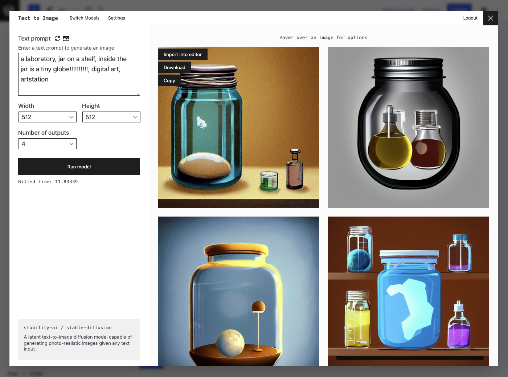

### Block Diffusion - a block editor plugin to interface with the Replicate API

Download the plugin from [wordpress.org](https://wordpress.org/plugins/stable-diffusion/)

If using the repo here, you need to first build it. Run `npm ci && npm run build`

- Follow me on Twitter: [https://twitter.com/kevinbatdorf](https://twitter.com/kevinbatdorf)
- Sponsor this package: [https://github.com/sponsors/KevinBatdorf](https://github.com/sponsors/KevinBatdorf)
- Create an account at [replicate.com](https://replicate.com/)

## Example Screenshots

